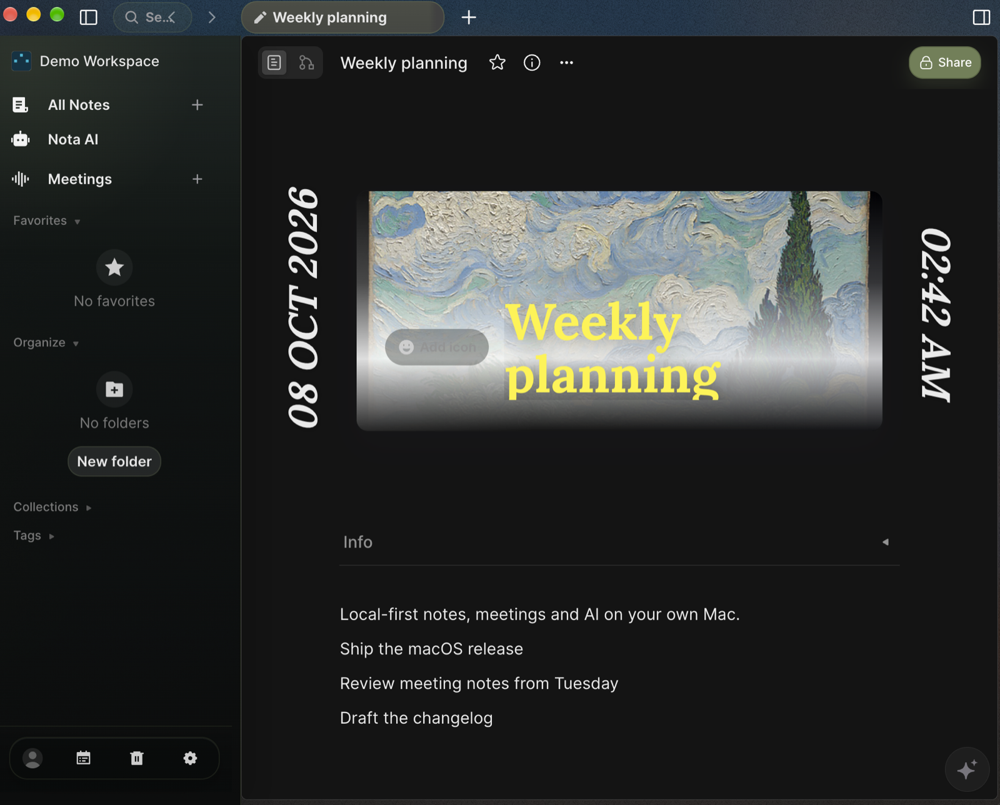

# Nota

[](https://github.com/madcodeorg/nota/actions/workflows/build-test.yml)
[](LICENSE)
[](https://github.com/madcodeorg/nota/releases)

Nota is a local-first workspace for documents, whiteboards, and on-device AI. It combines writing and visual thinking with local meeting transcription and workspace-aware AI.

Your workspace lives on your device. Local text AI requires compatible hardware and a model download unless the selected model is bundled. Hosted AI providers use your own API keys and require an explicit selection. Optional integrations must not prevent local writing.



## Downloads

Nota 0.1.0 is available for macOS (Apple silicon), signed and notarized. Download it from [thenota.app](https://thenota.app/download) or [GitHub Releases](https://github.com/madcodeorg/nota/releases). The app updates itself from thenota.app. Windows and Linux builds are not available yet.

See [GitHub Releases](https://github.com/madcodeorg/nota/releases) for published installers, checksums, release notes, and known limitations. Install only an asset listed for your operating system and architecture. The source tree contains additional platform targets; that does not establish that an installer is available or tested.

Read the [public getting-started guide](docs/public/README.md) before your first install. Beta releases are intended for evaluation; keep a separate backup of important workspaces.

## Build from source

The repository pins Node.js `22.22.1`, Yarn `4.12.0`, and Rust `1.93.1`.

```sh
git clone https://github.com/madcodeorg/nota.git
cd nota
corepack enable
yarn install
yarn nota @nota/native build
```

See [Building Nota](docs/BUILDING.md) for prerequisites and development commands, and [Building the desktop app](docs/building-desktop-client-app.md) for packaging. Source builds do not require release signing credentials.

## Contribute

Bug reports, documentation improvements, accessibility fixes, and focused code contributions are welcome. Read the [contribution guide](docs/CONTRIBUTING.md), [code of conduct](docs/CODE_OF_CONDUCT.md), and [contributor agreement](.github/CLA.md).

See [Privacy information](docs/PRIVACY.md) and [Usage and licensing](docs/TERMS.md) for local data and optional service behavior.

Report reproducible bugs through [GitHub Issues](https://github.com/madcodeorg/nota/issues). Include the release version, operating system, architecture, and steps to reproduce. Remove personal workspace content and credentials from logs before sharing them.

## License and upstreams

Nota began as a fork of [AFFiNE](https://github.com/toeverything/AFFiNE), with its [BlockSuite](https://github.com/toeverything/BlockSuite) editor. Original upstream work is copyright (c) 2022-present TOEVERYTHING PTE. LTD. Nota contributions are copyright (c) 2024-present Nota contributors.

Nota's project license is [MIT](LICENSE). Retain the upstream copyright and license notices when distributing source or binaries. Third-party packages, vendored code, documentation, and downloaded AI models can have separate terms; see [Third-party notices](THIRD_PARTY_NOTICES.md). Model license identifiers in the catalog are not a complete redistribution review.
