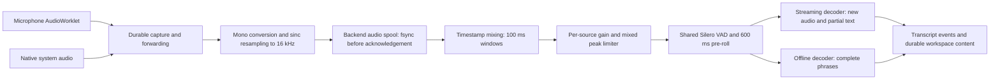

# Nota meeting pipeline review — October 5, 2026

## Decision

Use the existing local runtimes behind one capture and speech-segmentation path. Feed native streaming decoders continuously; decode offline Parakeet and Whisper once per completed phrase. Keep one ASR model resident by default. Mic capture runs at the AudioContext/device rate; native system audio retains its capture rate. The backend downmixes and uses the existing anti-alias sinc resampler to produce **16 kHz mono** for speech detection and ASR.

The decoder paths are alternatives chosen by the selected model. Only the selected decoder processes live speech. Whistle/Needle and multilingual Whisper Q5 now share this capture/VAD pipeline and produce phrase-final captions. Auto recommends Whistle where its runtime is supported; native Nemotron remains the streaming alternative. Speaker diarization is separate work.

## Evidence from other pipelines

| Project                         | Relevant behavior                                                                                                                                                                                            | Decision for Nota                                                                                                                                    |
| ------------------------------- | ------------------------------------------------------------------------------------------------------------------------------------------------------------------------------------------------------------ | ---------------------------------------------------------------------------------------------------------------------------------------------------- |
| Meetily                         | Native capture, microphone loudness normalization, 600 ms active mixer windows, Silero speech segments and 500 ms live silence endpoint. Parakeet runs on completed phrases. RNNoise is disabled by default. | Use source normalization and phrase endpoints; improve packet timing and source alignment in Nota's own code.                                        |
| RealtimeSTT                     | Recommends Sherpa Nemotron 560 ms INT8 for CPU live hypotheses, optionally followed by one Parakeet v3 INT8 final refinement. This recommendation is specifically for Linux x86-64.                          | Reuse native streaming state; omit a default second model because RAM is a priority.                                                                 |
| WhisperLiveKit / SimulStreaming | Warns that tiny independent Whisper chunks cut words and lose context. AlignAtt and LocalAgreement use context and stable output policies.                                                                   | Keep phrase context; do not pretend offline Whisper has native partials or re-decode every packet. Advanced Whisper streaming remains separate work. |
| Pipecat                         | Distinguishes continuous streaming from VAD-segmented batch recognition; uses 16 kHz input and recommends percentile latency measurement.                                                                    | Share the capture path, with decoder-specific behavior and visible timing metrics.                                                                   |
| NVIDIA / Sherpa                 | Cache-aware Nemotron accepts new audio and decodes when ready. Model exports determine encoder chunk sizes.                                                                                                  | Preserve the current 560 ms export. A 100 ms capture window does not change its intrinsic model latency.                                             |

Meetily's inspected Parakeet catalog contains `parakeet-tdt-0.6b-v3-int8` and `parakeet-tdt-0.6b-v2-int8`. Both use its offline phrase path. Its labels such as “Ultra Fast (v3)” and “real time on M4 Max” are catalog descriptions, not measured evidence from this review. Nota retains its existing native Sherpa Parakeet v3 INT8 adapter rather than replacing it with a custom decoder.

Meetily source was inspected at `a2cb62e827da7ef59f65064c97233efb2313878e`; stale comments advertising smaller mixer windows, adaptive ducking, and default noise suppression were not treated as active behavior. No Meetily source was copied into Nota.

## Implemented behavior

- Source spans use capture timestamps. Gaps remain gaps; sources are not concatenated into alternating or shifted speech windows.
- Mixing uses 100 ms windows, one packet of lookahead for a single observed source, and up to 200 ms of audio drift when both sources are observed. This trades a bounded source wait for alignment. It does not guarantee lower first-partial latency for every single-source case.
- Source gain is independent and bounded to 0.5–12×. Gain rises gradually, drops immediately for louder input, and considers source peaks. Below the fixed 0.0008 RMS gain floor, gain returns to unity. This floor is not an adaptive noise detector: audible background noise can still be amplified. The mixed peak stays below 0.95. Conditioning changes only the recognition copy; raw recordings and accepted spool PCM are preserved.
- Silero uses the official 512-new-sample plus 64-context-sample input contract and retains recurrent state. Its checksummed ~2.24 MB asset is prepared with native STT downloads/seeds, cached separately, and can migrate from existing model packages. Capture startup never downloads it.
- Missing/failed VAD is reported as energy fallback. Quiet speech is less reliable in that mode.
- Nemotron continues native decode during backlog and ends phrases after 500 ms silence, replacing the former 2 s endpoint. Offline Parakeet/Whisper retain their 400 ms endpoint. The existing 15 s utterance bound remains; this is not a 4 s slicing policy.
- The old 4 s source-queue eviction is removed. Stop drains queued frames and the exact final sample tail. A source arriving behind the consumed timeline cannot be inserted into a published live hypothesis; the late audio duration is reported and the original recording remains available.
- Large restart gaps use sparse spans rather than allocating or running VAD over minutes of zeros. Catch-up yields to the event loop after ten windows, across packet boundaries.
- Microphone preparation and activation explicitly resume suspended AudioContexts and fail visibly if the context cannot run.
- Live `stt.pipeline` metrics expose window/source-wait settings, VAD mode, late audio, queued audio, audio time, and partial/final decode durations. The existing realtime factor now includes offline final decode time. These are live diagnostics; restored sessions start fresh diagnostics.
- Disk acceptance, retry deduplication, native archives, meeting finalization, and workspace persistence retain their existing ownership and guarantees.

## Validation and limits

Validation passed: 159 tests in 19 focused suites; backend and microphone-helper typechecking; focused ESLint using a narrowed TypeScript project; `git diff --check`. The repository-wide lint project reached its existing Node heap limit before the narrowed check succeeded.

Tests use generated PCM and mocked decoders/VAD. They cover stereo 48 kHz input reaching the decoder as mono 16 kHz, acknowledgement while a decoder is blocked, retry deduplication, timestamp alignment, source stalls, late frames, quiet-input gain, clipping, phrase finalization, stop tails, restart gaps, recurrent VAD context, missing/corrupt assets, and suspended microphone contexts.

No real model inference, recording, model package download, desktop rebuild, or application replacement was performed. This establishes pipeline behavior, not a measured speed/accuracy advantage over Meetily. A future authorized device test should measure capture-to-first-text, speech-end-to-final, missed speech, backlog and peak RAM on Mac ARM/x86, Windows and Linux; report P50/P90/P99 separately by model and input source.

## Sources

- [Meetily source](https://github.com/Zackriya-Solutions/meetily/tree/a2cb62e827da7ef59f65064c97233efb2313878e)
- [RealtimeSTT engine recommendations](https://github.com/KoljaB/RealtimeSTT)
- [WhisperLiveKit architecture](https://github.com/QuentinFuxa/WhisperLiveKit)
- [SimulStreaming](https://github.com/ufal/SimulStreaming)
- [Pipecat speech-to-text guidance](https://docs.pipecat.ai/pipecat/learn/speech-to-text)
- [Sherpa streaming JavaScript API](https://k2-fsa.github.io/sherpa/onnx/javascript-api/examples/api_streaming_asr.html)
- [Sherpa Parakeet with VAD](https://k2-fsa.github.io/sherpa/onnx/pretrained_models/offline-transducer/nemo/parakeet-tdt-0.6b-v2.html)
- [NVIDIA Nemotron model](https://huggingface.co/nvidia/nemotron-3.5-asr-streaming-0.6b)
- [Silero official ONNX wrapper](https://github.com/snakers4/silero-vad/blob/master/src/silero_vad/utils_vad.py)

## Native model integration validation

Whistle uses the official Cactus Needle static library and a pinned Apache-2.0
`.cact` model (16,919,407 bytes). Whisper uses pinned MIT whisper.cpp source with
multilingual Q5 packages: Tiny/Base/Small Q5_1, Medium/Large v3 Q5_0. Persistent
helper processes accept private PCM16 binary frames over stdio; no Python,
local HTTP server or network inference is required. Models reload only after
idle expiry (60 s), failure or switching sizes. Idle previous native helpers are
released when loading another model; in-flight decoding completes safely.

The common engine cuts complete phrases using VAD. A helper accepts at most 30 s
per request; retained/file audio is divided into at most 20 s requests, without
capping the entire recording. This is phrase-final transcription, not stable
word-by-word Whisper/Whistle streaming. Hard file boundaries can still cut
words; sustained meeting quality and latency need actual capture acceptance.

Apple inventory comes from SpeechTranscriber.supportedLocales/installedLocales.
The selected locale is validated against the device, provisioned explicitly via
AssetInventory, and passed into the Swift stream/file helper. Auto snapshots the
supported system locale. The legacy binding rejects an explicit locale it cannot
honor. SwiftPM's active binary directory is queried when packaging to avoid
shipping a stale cached helper. Apple retained audio can recover through an
installed native model that supports the snapshotted language.

Measured on this Apple Silicon Mac using whisper.cpp's 11 s JFK fixture, two
requests to each newly started helper (Auto, then English), CPU recognition:

| Helper            | Load    | Auto decode | English decode | Peak helper RSS |
| ----------------- | ------- | ----------- | -------------- | --------------- |
| Whistle/Needle    | 0.152 s | 0.040 s     | 0.036 s        | 62.8 MiB        |
| Whisper Tiny Q5_1 | 0.112 s | 0.179 s     | 0.100 s        | 114.2 MiB       |

Peak RSS was measured with macOS `/usr/bin/time -l`, not inferred from download
size or the Settings device minimum. It excludes Electron, VAD and other local
AI models. A separate adapter smoke transcribed 44 s of repeated fixture audio
through both helpers. These short, clean fixtures do not establish meeting
accuracy, all-language accuracy, or Windows/Linux performance. Only Tiny was
run from the five Whisper sizes; all size mappings/provisioning/preload routes
are covered by mocked integration tests. Mac Intel is outside this delivery.

Native build prerequisites: CMake 3.16+, a C++17 compiler, Git and network access
to official pinned source/runtime assets; Xcode/Swift for the Apple helper.
`NOTA_CMAKE_PATH` can select a build-only CMake executable. Desktop layers and
renderer are built locally; Windows/Linux packaging needs target-native checks.

End-to-end fixture check: prepared checksummed seed packages (including Silero),
started a temporary authenticated backend, and posted 120 mono/16 kHz float32
capture frames at 100 ms timestamps for each of Whistle and Whisper Tiny Q5.
Both produced the fixture transcript through the real meeting session pipeline,
reported `vadMode: silero`, and stopped with all captured speech covered, zero
failed speech chunks and no queued audio. This verifies API ingestion and the
actual native adapter together; it does not verify OS microphone/system capture.
The separate internal Apple Silicon app is packaged with Whistle, Tiny Q5,
verified Silero copies, all three ASR helpers and their licenses. The installed
application is not replaced by this local build.

Final local validation: 346 backend tests, 94 Meeting Settings tests, 15 Apple
finalization tests and 7 microphone tests passed (462 total). Backend and
Electron TypeScript checks and scoped lint passed. The Settings source typecheck
reported the same 20 pre-existing dependency errors as the saved baseline, with
no errors in Settings. The broad mixed frontend test configuration also cannot
resolve existing `@nota/core/blocksuite/store-extensions/ai` imports in two
meeting-save suites; those suites were not represented as passing.
Final bundle inspection verified all model/VAD SHA256 hashes, arm64 helper
binaries, current backend code and Apple setup IPC. The packaged Apple helper
successfully returned the actual device locale inventory.

## Low-delay recognition conditioning validation

The new gain handling passed all **351 backend tests**, backend TypeScript,
scoped ESLint and formatting checks. Signal tests cover low-level input,
gain reduction after loud input, transient peaks, independent mic/system gain,
packet boundaries, exact stop tails and unchanged input PCM. Existing durable
acceptance/retry/restart tests also pass. No high-pass filter ships in this change.

On this Apple Silicon Mac, three synthetic runs each processed 6,000 dual-source
100 ms windows, discarding the first 1,000 timing samples as warmup. The complete
mock-decoder/VAD pipeline measured 0.023–0.025 ms P50 and 0.040–0.045 ms P95 per
100 ms window with conditioning, versus 0.015–0.016 ms P50 and 0.030–0.037 ms
P95 before this change. All runs delivered exactly 9,600,000 mixed samples.
These wall-clock timings include mixer allocation, gain, mocked
callbacks and event-loop yields; they are not real decoder or OS capture
latency measurements. Conditioning adds no buffered samples. Existing
100/200 ms source waits and model/phrase delays still apply.

The real Cactus Whistle and Whisper Tiny Q5 helpers with Silero were compared before/after
on the 11-second whisper.cpp JFK sample, the same sample scaled to 8% amplitude
(about -22 dB), and the same sample with a 20 Hz sine added at 3,000 PCM units
peak. Whistle produced all 22 reference words without word errors in each
condition before and after this gain change, using case/punctuation
normalization. Whisper Tiny Q5 had zero word errors for clean/rumble and one
word error for quiet audio in both versions; the particular quiet error changed.
A 70 Hz filter candidate caused three Whistle word errors on the quiet fixture.
A gentler 40 Hz filter avoided that Whistle regression but introduced two errors
for Whisper Tiny on the clean fixture. Frequency filtering is therefore deferred.
This small fixture check establishes
neither a general WER improvement nor a real-meeting advantage. The added
rumble and quiet conditions are synthetic, and general noise suppression,
echo cancellation, room reverberation and overlapping speakers remain outside
this change.

Local validation artifacts are `/tmp/nota-audio-cleanup-benchmark.mts`,
`/tmp/nota-audio-cleanup-benchmark.json`, `/tmp/nota-audio-cleanup-asr.mts`,
`/tmp/nota-audio-cleanup-asr.json`, `/tmp/nota-audio-cleanup-whisper-asr.json`
and `/tmp/nota-audio-cleanup-tests.log`.

The final gain-only Apple Silicon build was signed, verified and installed in
`/Applications/Nota.app`, then reopened. The installed backend matches the tested
bundle (SHA256 `43b30a0160b075521c4c4fbe785536f4c49d14b4beac70a922b37715b9bd7d61`).
The restarted backend retained 43 meetings, including the latest meeting's
duration, linked note and exported system/microphone recordings. Installation
waited for stopped capture and complete exports. The previous app and local data
are backed up under `Nota Backups/20261005-114844-audio-gain` in Application
Support. No new live recording or visible UI acceptance test was performed.
